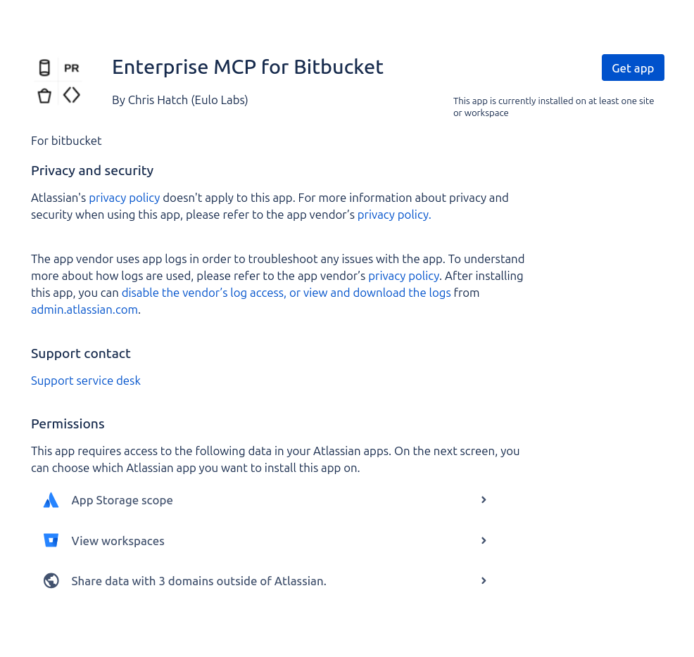
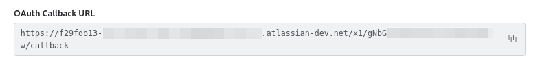
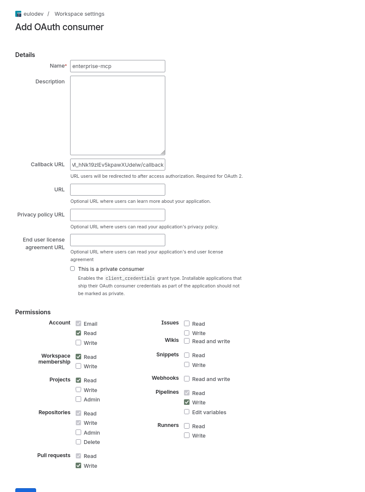
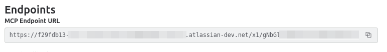

# Setup Guide

## Administrator Setup

Complete these steps to install and configure the MCP server for your workspace.

### 1. Install the App

Install the Bitbucket Enterprise MCP Server by App Installation link (soon to be replaced by Marketplace install):

[App Install Link](https://developer.atlassian.com/console/install/f29fdb13-c3ac-4e38-a7be-9ca0d8d5b6ac?signature=AYABeDBpVYOCwNheXdrLMHGk9zMAAAADAAdhd3Mta21zAEthcm46YXdzOmttczp1cy13ZXN0LTI6NzA5NTg3ODM1MjQzOmtleS83MDVlZDY3MC1mNTdjLTQxYjUtOWY5Yi1lM2YyZGNjMTQ2ZTcAuAECAQB4IOp8r3eKNYw8z2v%2FEq3%2FfvrZguoGsXpNSaDveR%2FF%2Fo0Bt5hs1j%2Fx52K8v42vF0UdAwAAAH4wfAYJKoZIhvcNAQcGoG8wbQIBADBoBgkqhkiG9w0BBwEwHgYJYIZIAWUDBAEuMBEEDDcG56rhiJSmP9J%2FQwIBEIA7RT9QdtG%2BG9Lxi%2Beo74Putt2YleIAVw8kyhk9Z1pDsaCiPssbX5dpJlAEGepWGtU%2FTsBIAwrhJ1i9GS4AB2F3cy1rbXMAS2Fybjphd3M6a21zOmV1LXdlc3QtMTo3MDk1ODc4MzUyNDM6a2V5LzQ2MzBjZTZiLTAwYzMtNGRlMi04NzdiLTYyN2UyMDYwZTVjYwC4AQICAHijmwVTMt6Oj3F%2B0%2B0cVrojrS8yZ9ktpdfDxqPMSIkvHAFCGonl8VJXtjtHEK4OqVemAAAAfjB8BgkqhkiG9w0BBwagbzBtAgEAMGgGCSqGSIb3DQEHATAeBglghkgBZQMEAS4wEQQMakSStqRDooWTfkGGAgEQgDtZSic6vkwDgCEMpE2vTaAt%2BV%2FRfOzndriokOhIW4wvTldMELXGrR24OpPjTLnMgVA0Q2RsMRvk7h4NGgAHYXdzLWttcwBLYXJuOmF3czprbXM6dXMtZWFzdC0xOjcwOTU4NzgzNTI0MzprZXkvNmMxMjBiYTAtNGNkNS00OTg1LWI4MmUtNDBhMDQ5NTJjYzU3ALgBAgIAeLKa7Dfn9BgbXaQmJGrkKztjV4vrreTkqr7wGwhqIYs5AdIOsqk6trru96DoVW4baWwAAAB%2BMHwGCSqGSIb3DQEHBqBvMG0CAQAwaAYJKoZIhvcNAQcBMB4GCWCGSAFlAwQBLjARBAyTtepde8IMfkxVeJ8CARCAO2Zd5oAPc0OAc99t7RfWA%2FODGUN6Lix%2BhyqYM8aRBDNaQuPOJr7Ppc5%2Fuc0Lxv9sgOBxqMW%2B6qXVrVFlAgAAAAAMAAAQAAAAAAAAAAAAAAAAAE%2F9%2F1HHpjdBVpeqq7nSQ%2BH%2F%2F%2F%2F%2FAAAAAQAAAAAAAAAAAAAAAQAAADJcFoo3HpqeMYZTtofKPpdHX1aJRkiC5i29QnrP8wf6U1LgrCqXRY0%2BlU7te3fMxpqod3SoMO7SSV%2BSirAUT9iyBFU%3D&product=bitbucket)

1. Click the link above, choose your site and click Install
2. Once installed, continue to the next step below
   > **NOTE:** You can also self-host by deploying this Forge app to your own Atlassian site instead. See the [Development](../README.md#development) section for instructions.



### 2. Create a Bitbucket OAuth Consumer

1. In Bitbucket, navigate to: **Workspace Settings > Forge Apps > MCP Server Settings**
2. Copy the **OAuth Callback URL**



3. Click on the Workspace Settings link under the OAuth Configuration section at the top of the page.
4. Fill out the OAuth Consumer form like this:



5. Save and note the **Key** (client ID) and **Secret** (client secret)

### 3. Complete Configuration on Admin Panel

1. Go back to the MCP Server Settings page
2. Enter the OAuth credentials from the last step:
   - **Client ID:** the Key from step 2
   - **Client Secret:** the Secret from step 2
3. Save the configuration

## User Setup

### 1. Configure your AI Client

Copy the **MCP Endpoint URL** from the admin panel's Settings tab, then configure your AI client as below.



#### Claude Code

Add the MCP server to your Claude Code configuration. Copy the **MCP Endpoint URL** from the admin panel's Settings tab (see step 3), then add to `~/.claude.json` under `projects > <project-path> > mcpServers`:

```json
{
  "bitbucket-mcp": {
    "type": "http",
    "url": "<mcp-endpoint-url>",
    "oauth": {
      "authServerMetadataUrl": "<mcp-endpoint-url>/.well-known/openid-configuration"
    }
  }
}
```

Or add it via the CLI:

```bash
claude mcp add-json bitbucket-mcp '{"type":"http","url":"<mcp-endpoint-url>","oauth":{"authServerMetadataUrl":"<mcp-endpoint-url>/.well-known/openid-configuration"}}'
```

> **Why `authServerMetadataUrl`?** Forge web triggers can only serve paths under a specific prefix. Standard OAuth metadata discovery (RFC 8414) expects `.well-known` URLs at the domain root, which Forge's infrastructure doesn't route to the app. The `authServerMetadataUrl` override tells Claude Code where to find the metadata directly.

#### Open AI Codex

Codex supports streamable HTTP MCP servers and OAuth login via the CLI.

```bash
codex mcp add bitbucket-mcp --url "<mcp-endpoint-url>"
```

### 2. Authenticate

Most clients will prompt you to Authenticate under /mcp.

This will open the browser and ask you to give consent to the app connecting to Bitbucket on your behalf.

Scopes to approve are clearly displayed.
